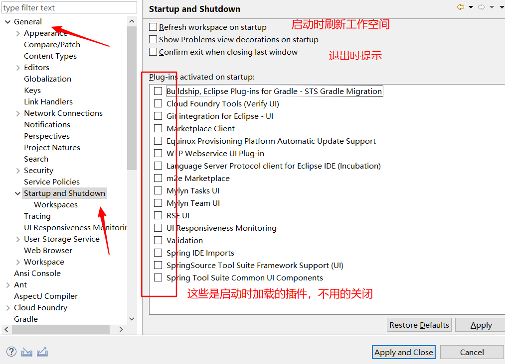
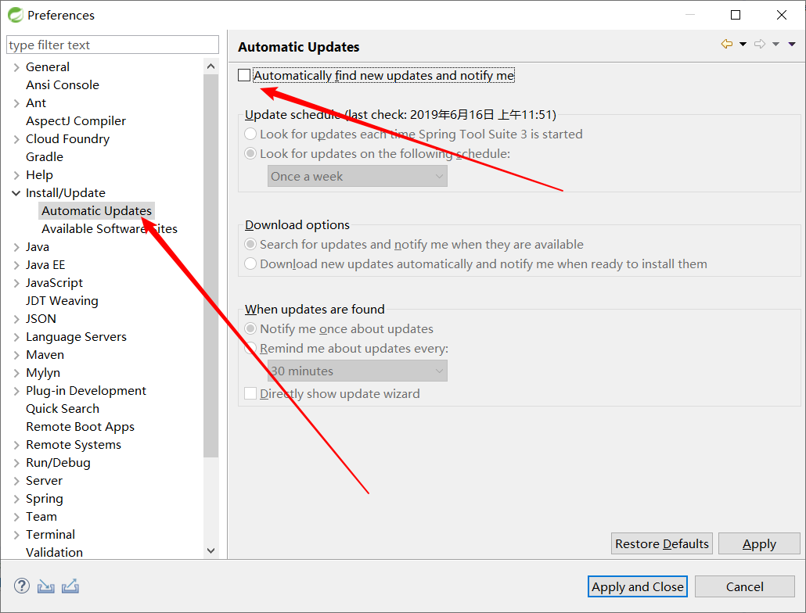
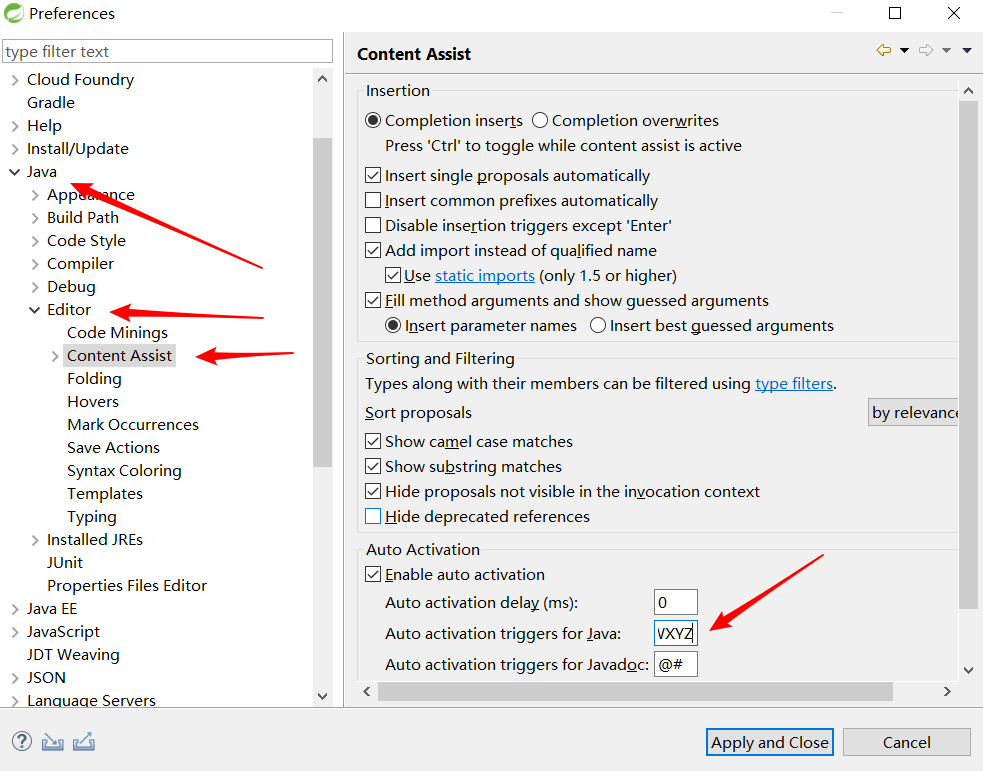
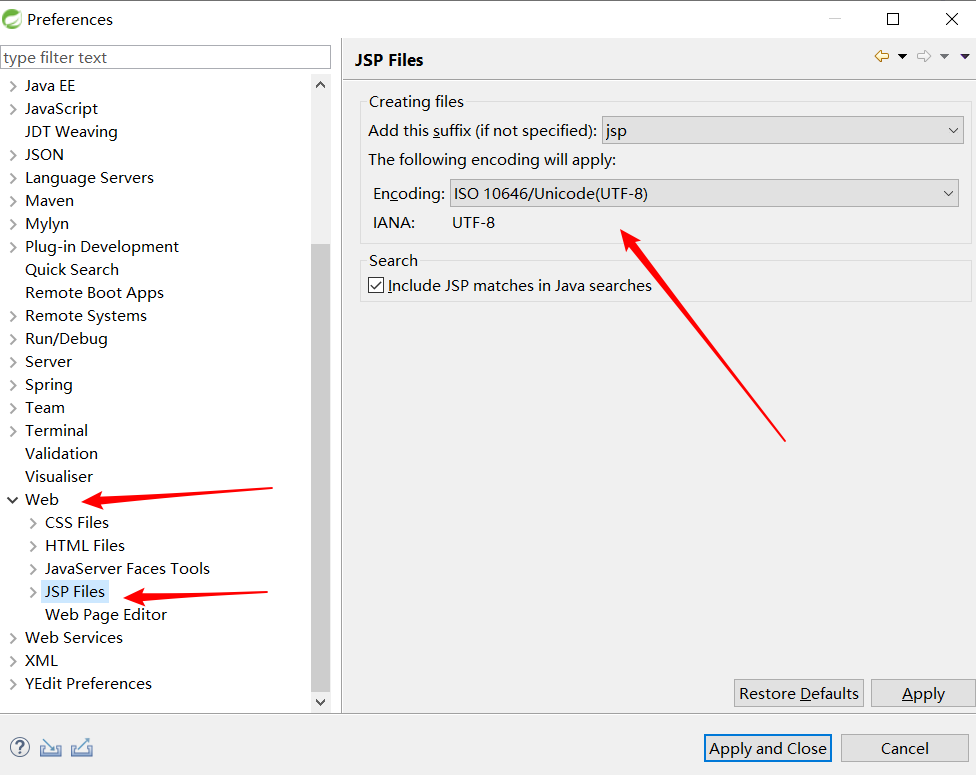
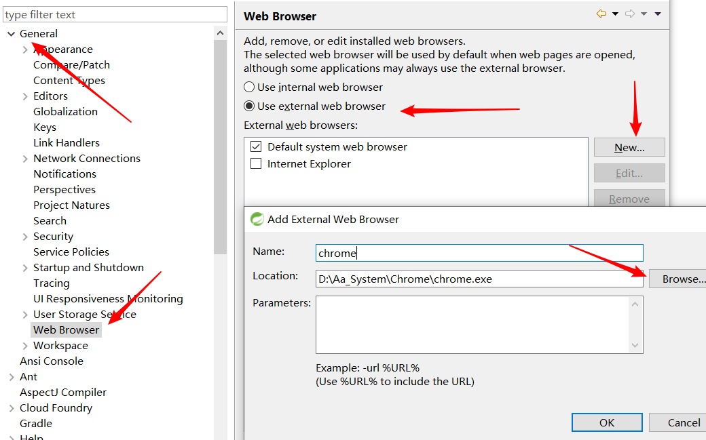

[TOC]

## STS 的下载

> Spring Tool Suite 是一个基于eclipseIDE开发环境中的用于开发spring应用程序的工具。提供了开箱即用的环境用于实现，调试和部署你的spring应用，包括为关键的的服务器和云计算，Git,Maven,AspectJ,和最新的Eclipse版本提供整合支持。

进入[STS官网](<https://spring.io/tools3/sts/all>) ，下载解压即可。

## Eclipse 的优化

- 关闭启动时激活的插件

  

- 关闭启动时的更新检查

  

## 代码自动补全

添加 .abcdefghijklmnopqrstuvwxyzABCDEFGHIJKLMNOPQRSTUVWXYZ

## JSP 的编码

## Web 的输出浏览器

