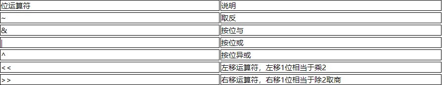

## 运算符的分类


## 自动类型转型


黑色的实线表示无数据丢失的自动类型转换，而虚线表示在转换时可能会有精度的损失。

在算术运算中，数据会自动向上类型提升。


## 强制类型转换

强制类型转换，又被称为造型，用于显式的转换一个数值的类型。在有可能丢失信息的情况下进行的转换是通过造型来完成的，但可能造成精度降低或溢出。

语法格式
```java
(type)var
```

## 逻辑运算符


短路原则：从左到右计算，如果只通过运算符左边的操作数就能够确定该逻辑表达式的值，则不会继续计算运算符右边的操作数，提高效率。


## 位运算符

对二进制进行计算。



左移（<<）
在内存中，将该变量的二进制数直接向左移动，超出内存的丢弃，右边补0，所以结果将乘2的n次方

带符号右移（>>）
在内存中，将该变量的二进制数直接向右移动，超出内存的丢弃，左边根据最高位是什么补什么，所以结果将除2的n次方

带符号右移（>>>）
左边始终会补0，负数的带符号右移慎用
