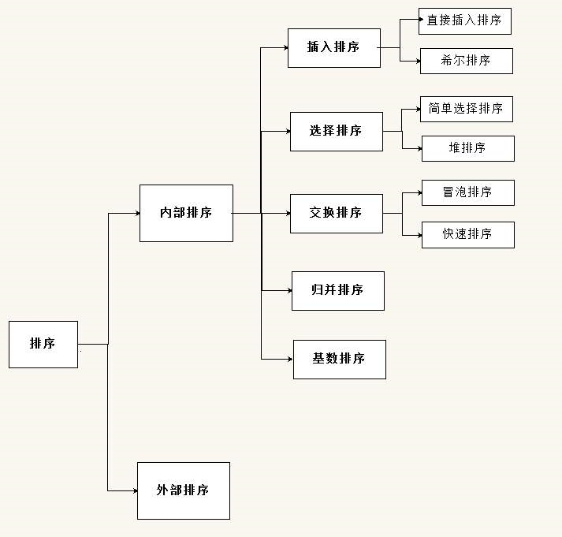
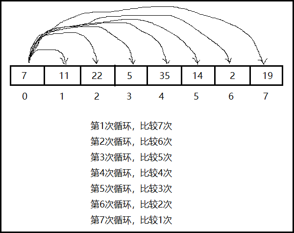
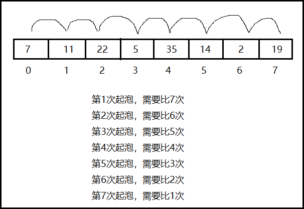

## 八大排序方式




## 稳定与非稳定

如果一个排序算法能够保留数组中重复元素的相对位置则可以被称为是稳定的。反之，则是非稳定的。


## 选择排序

用第一个位置的元素与其后的所有元素依次比较，将比其大/小的元素置换在第一个位置；然后继续第二个位置的元素，直到length-1个位置元素。



```java
int temp = 0;
for (int i = 0; i < arr.length-1; i++) {
    for (int j = i+1; j <arr.length; j++) {
        if (arr[i] > arr[j]) {
            temp = arr[i];
            arr[i] = arr[j];
            arr[j] = temp;
        }
    }
}
// 外层循环控制比较位置
// 内存循环控制比较次数
```


## 冒泡排序

用相邻的两个元素比较，将最小/最大的元素冒泡到最后位置。



```java
int temp = 0;
for (int i = 0; i < arr.length-1; i++) {
    for (int j = 0; j < arr.length-i-1; j++) {
        if (arr[j] > arr[j+1]) {
            temp = arr[j];
            arr[j] = arr[j+1];
            arr[j+1] = temp;
        }
    }
}
// 外层循环控制起泡次数
// 内层循环控制比较次数
```


## 二分法查找

二分法查找也称为折半查找，适用于数据量较大时，但数据需要先排好序。

```java
public static int binarySearch(int[] array, int num) {
    int flag = -1;
    int star = 0;
    int end = array.length-1;
    int mid = 0;
    while(star <= end){
        mid = (star+end)>>2;
        if(array[mid] != num){
            if (array[mid] > num) {
                end = mid - 1;
            }else{
                star = mid + 1;
            }
        }else{
            flag = mid;
            break;
        }
    }
    return flag;
}
```