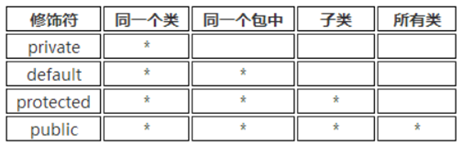

## 封装的概念

在面向对象程序设计方法中，封装是指一种将抽象性函式接口的实现细节部分包装、隐藏起来的方法。

封装可以被认为是一个保护屏障，防止该类的代码和数据被外部类定义的代码随机访问。

要访问该类的代码和数据，必须通过严格的接口控制。

封装最主要的功能在于我们能修改自己的实现代码，而不用修改那些调用我们代码的程序片段。

适当的封装可以让程式码更容易理解和维护，也加强了程式码的安全性。

## 封装的优点

1. 提高代码的安全性。
2. 提高代码的复用性。
3. “高内聚”：封装细节，便于修改内部代码，提高可维护性。
4. “低耦合”：简化外部调用，便于调用者使用，便于扩展和协作。

