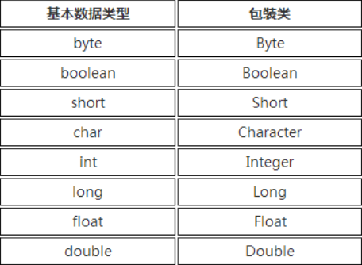
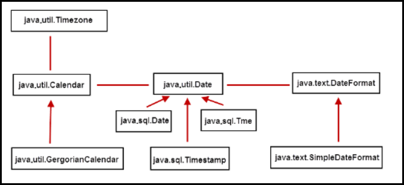

## 包装类



包装类均位于java.lang包中。


## String类

String类对象代表的是不可变的Unicode字符序列，被final所修饰，因此将String对象称为“不可变对象”，即对象内部的成员变量的值无法再改变。

在字符串的比较时，“==”判断是否是同一个对象，“equals”判断内容是否相同。

### StringBuffer/StringBuilder

可变的字符串对象，内部没有被final所修饰。

StringBuffer是JDK1.0版本提供，线程安全，做线程同步检查，效率低。

StringBuilder是JDK1.5版本提供，线程不安全，不做线程同步检查，效率高，常用。


## 时间类

在计算机时间中，把1970年1月1日00:00:00定为基准时间，每个度量单位是毫秒。



获取时刻数值

```java
long now = System.currentTimeMillis();
```
