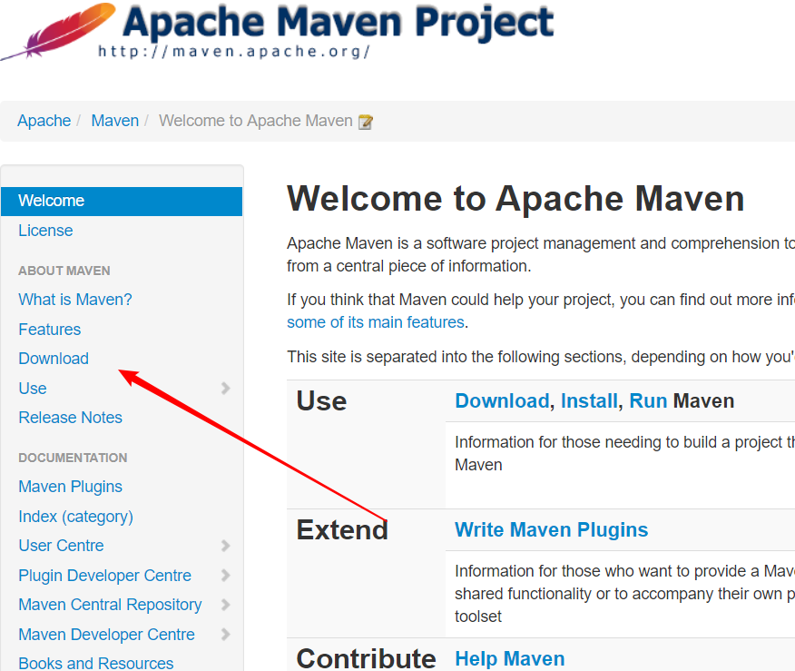
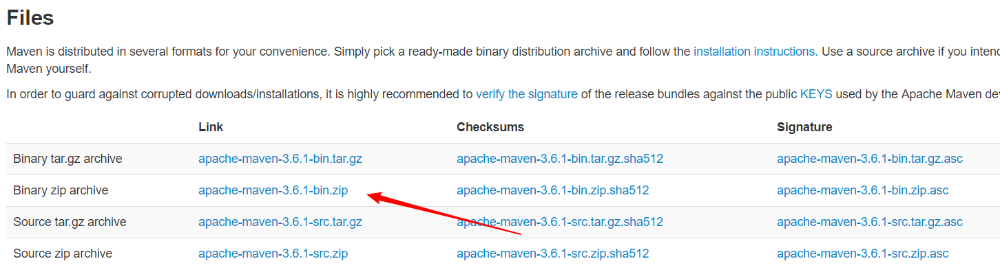

## 什么是 Maven

Maven 是一个由 Apache 公司推出的一个管理项目的工具，它包含了一个项目对象模型，一组标准集合，一个项目生命周期，一个依赖管理系统，和用来运行定义在生命周期阶段中插件目标的逻辑

## Maven 能解决什么问题

1. 管理 jar 包，防止 jar 包冲突
2. Maven 也能帮助编译 Java 文件
3. 用于单元测试
4. 项目打包

## Maven下载及配置

* 下载，进入 Apache 官网找到 [Maven](<http://maven.apache.org/>) ，点击 Download。

  
  
  然后下载对应版本。
  
  

* 配置

  1. 在环境变量中创建 MAVEN_HOME 并添加主路径
  2. 在 path 中添加 %MAVEN_HOME%\bin 即可
* 测试，在 cmd 中输入 mvn -v

## 仓库机制

maven 工程中的 jar 包是通过坐标来寻找的，首先会在系统盘中找本地仓库中的 jar 包，如果没有需要的包会在联网的情况下从中央仓库中下载（中央仓库有所有的 jar 包）

公司会有自己的远程仓库（私服），在同一局域网即可，如果也没有同样会在中央仓库中下载

## Maven 项目标准目录结构

* src/main/java	核心代码

* src/main/resources	配置文件

* src/test/java	测试代码

* src/test/resources	测试配置文件

* src/main/webapp	页面资源（js,jsp,css,图片等）

## Maven 命令

1. mvn clean    清理之前的编译信息
2. mvn compile    编译文件放在 target 目录中
3. mvn test    编译文件和测试代码
4. mvn package    编译打包（代码和测试都编译）
5. mvn install    编译打包并放至本地仓库

## Maven 概念模型

* 项目对象模型（pom.xml）

  放置了项目自身信息，项目运行时需要的 jar 包信息，项目运行环境信息（jdk,tomcat）

* 依赖管理模型

  放置了 jar 包的坐标

## jar 包坐标

一个 jar 包包含3个以上基本信息

```xml
<dependencies>
    <dependency>
        <!--公司组织名称-->
        <groupId>javax.servlet.jsp</groupId>
        <!--项目名-->
        <artifactId>jsp-api</artifactId>
        <!--版本号-->
        <version>2.0</version>
    </dependency>
</dependencies>
```

### 设置 Maven

设置本地仓库位置，打开文件中的 conf 文件下的 settings.xml 。

大概在 53 行左右，将其提出注释之外进行设置。


设置中央仓库为阿里镜像。


添加内容：

```xml
<mirror>
	    <id>nexus-aliyun</id>
	    <mirrorOf>*</mirrorOf>
	    <name>Nexus aliyun</name>
	    <url>http://maven.aliyun.com/nexus/content/groups/public</url>
	</mirror>
```

## IDEA 加入 Maven

在 Settings 中搜索 maven 找到路径即可，在 Runner 中输入 `-DarchetypeCatalog=internal` 可以在本地找 jar 包

## Maven 本地仓库路径修改

在 conf 中的 settings.xml 中找到 `<localRepository>/path/to/local/repo</localRepository>`

在其后追加一行并加上路径

