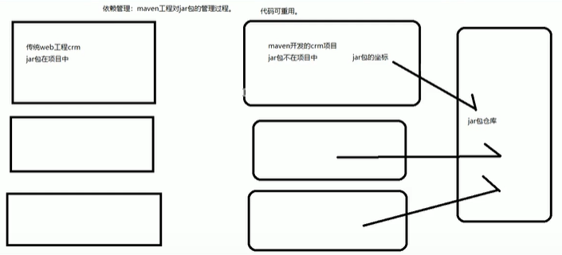

## 什么是 Maven

Maven 是一个由 Apache 公司推出的一个管理项目的工具，它包含了一个项目对象模型，一组标准集合，一个项目生命周期，一个依赖管理系统，和用来运行定义在生命周期阶段中插件目标的逻辑

## Maven 能解决什么问题

1. 管理 jar 包，防止 jar 包冲突
2. Maven 也能帮助编译 Java 文件
3. 用于单元测试
4. 项目打包

## Maven 的优势

### 代码重用，节省磁盘空间

Maven 的 JAR 管理方式是将 JAR 包放在了项目之外的本地仓库中，而不再是传统那样直接导入项目中，并且实现了 JAR 包的重用，

### 项目一键重构

项目往往要经历编译、测试、运行、打包、安装、部署等过程，而 Maven 提供了自带的 Tomcat 可以将整个过程都交给 Maven 进行管理，这个过程就是构建

如进入项目目录进入命令窗口输入 mvn tomcat:run

即可将项目跑起来

## IDEA 加入 Maven

在 Settings 中搜索 maven 找到路径即可，在 Runner 中输入 `-DarchetypeCatalog=internal` 可以在本地找 jar 包

