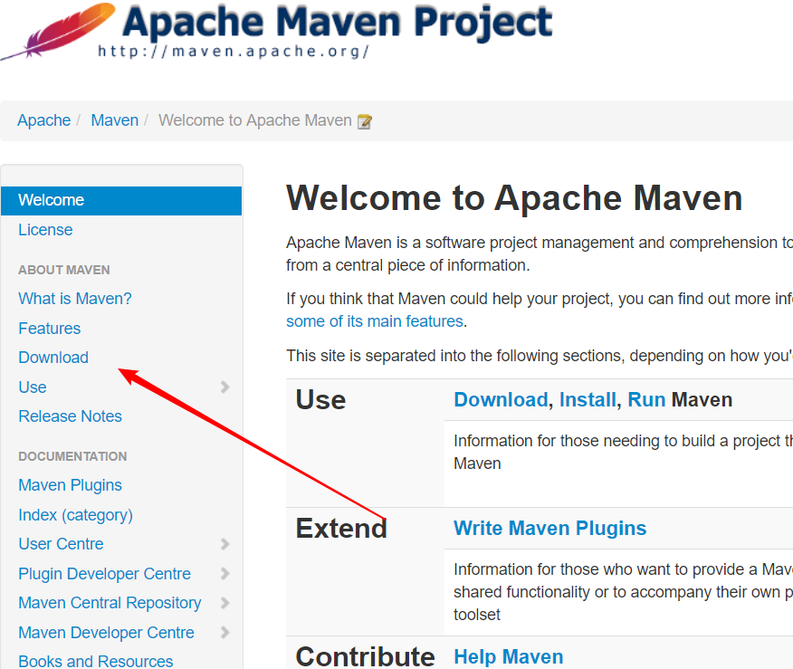
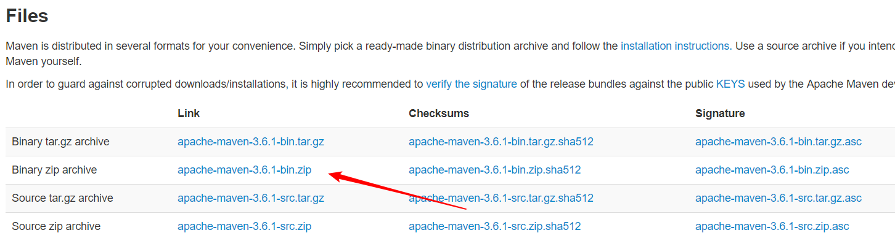
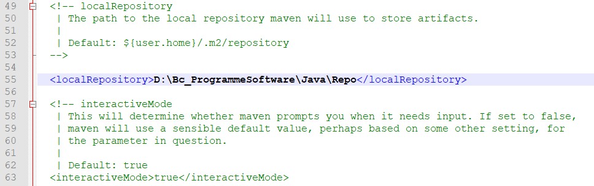
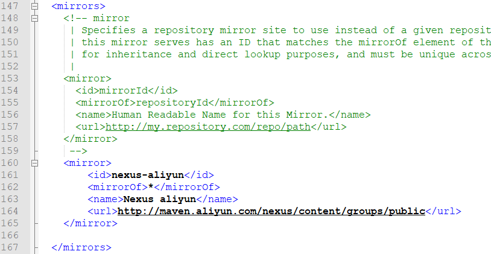

## Maven 的下载

进入 [Apache官网](<http://maven.apache.org/>) ，找到 Maven 的下载地址



下载相应的压缩包即可




## Maven 的配置

将解压后的 bin 目录配置到环境变量的 PATH 中即可，在 cmd 中输入 `mvn -v` 测试是否配置成功

**注意** ：环境的配置依赖 JAVA_HOME ,还有可能会配置 MAVEN_HOME ,同 JAVA_HOME 一样的方法


## 仓库位置的修改

进入 conf 目录打开 settings.xml ，大概在50行左右




## 修改中央仓库

将中央仓库修改为阿里镜像



添加内容：

```xml
<mirror>
	    <id>nexus-aliyun</id>
	    <mirrorOf>*</mirrorOf>
	    <name>Nexus aliyun</name>
	    <url>http://maven.aliyun.com/nexus/content/groups/public</url>
	</mirror>
```

