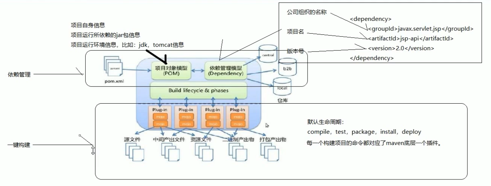

## Maven 概念模型

- 项目对象模型（pom.xml）

  放置了项目自身信息，项目运行时需要的 jar 包信息，项目运行环境信息（jdk,tomcat）

- 依赖管理模型

  放置了 jar 包的坐标


## jar 包坐标

一个 jar 包包含3个以上基本信息

```xml
<dependencies>
    <dependency>
        <!--公司组织名称-->
        <groupId>javax.servlet.jsp</groupId>
        <!--项目名-->
        <artifactId>jsp-api</artifactId>
        <!--版本号-->
        <version>2.0</version>
    </dependency>
</dependencies>
```

## 



