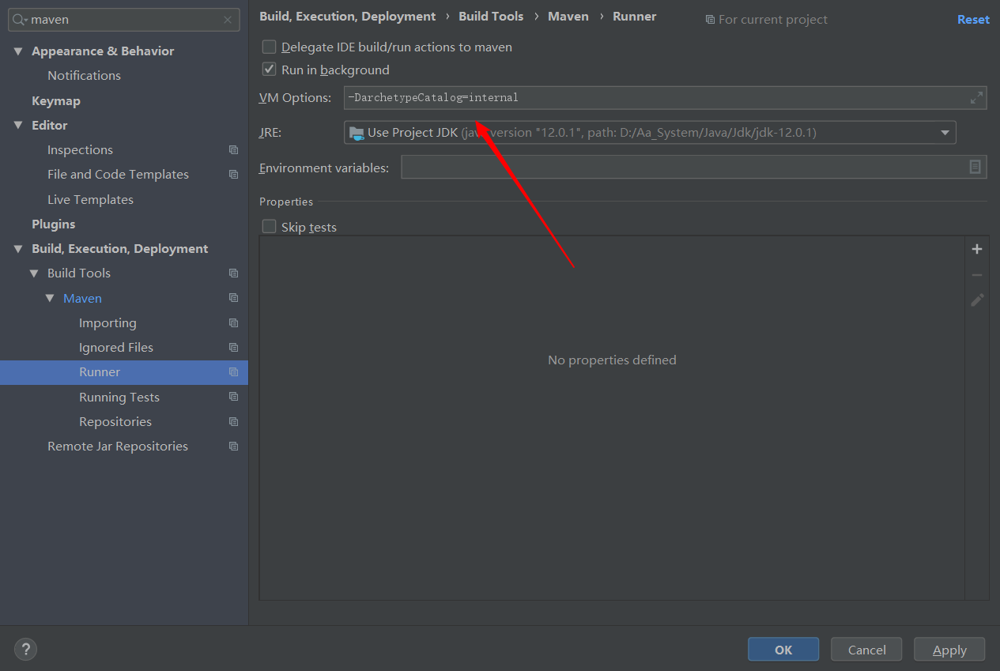
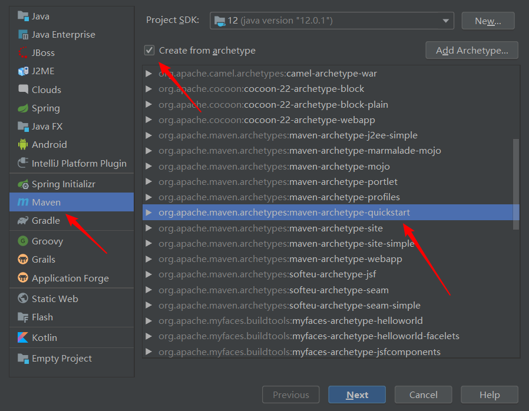
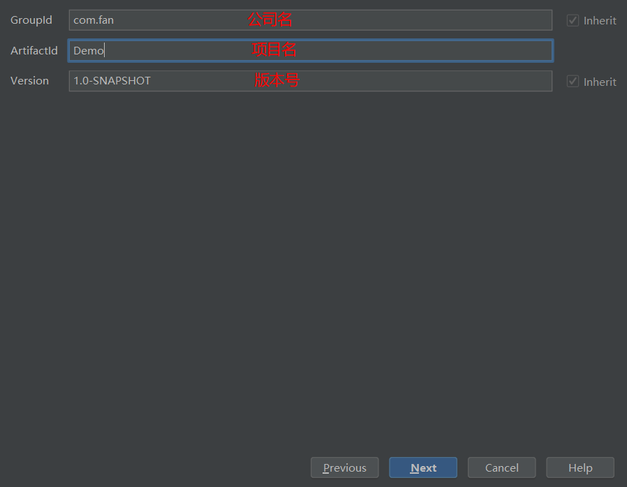
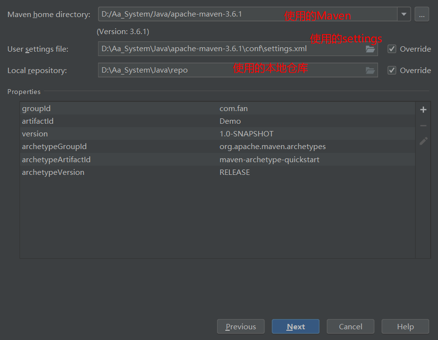
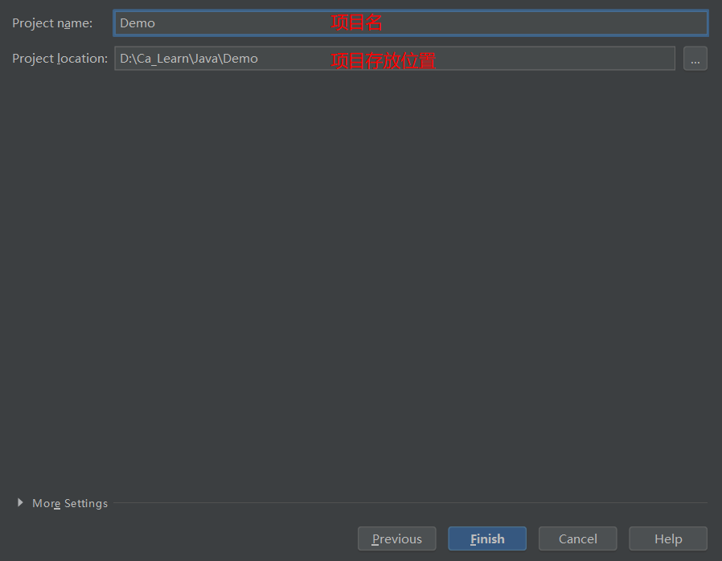
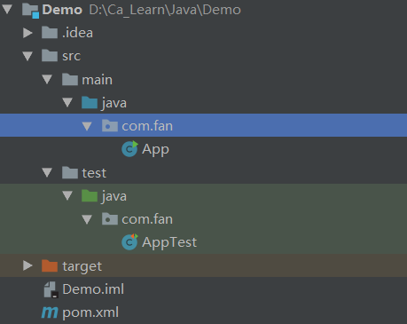
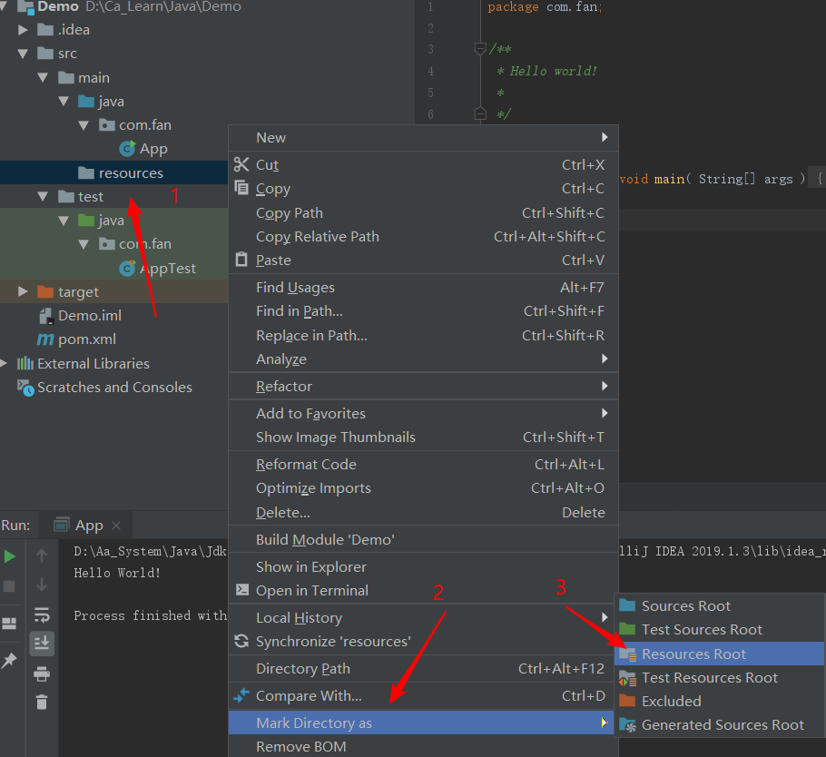
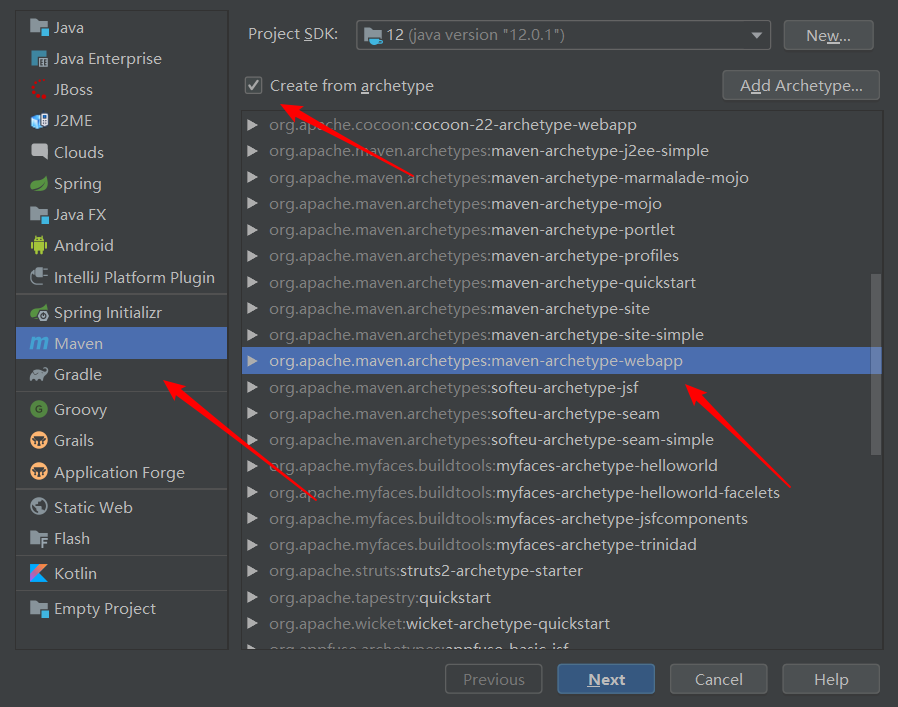
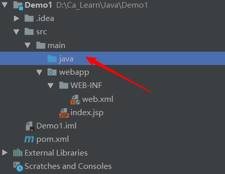

## IDEA 集成 Maven

- 进入 Settings 搜索 maven
- 配置本地 Maven 路径
- 配置本地 Settings 路径


## 保存骨架插件



```
-DarchetypeCatalog=internal
```


## 使用骨架创建 JAVA 项目









骨架默认目录：



补全目录结构：

在 main 创建 resources 目录并设为资源目录



test同样


## 不使用骨架创建 JAVA 项目

即创建时不勾选骨架即可，其余类似，创建的目录更规范，JAVA 项目推荐不使用骨架


## 使用骨架创建 web 项目



下面类似

补齐目录



